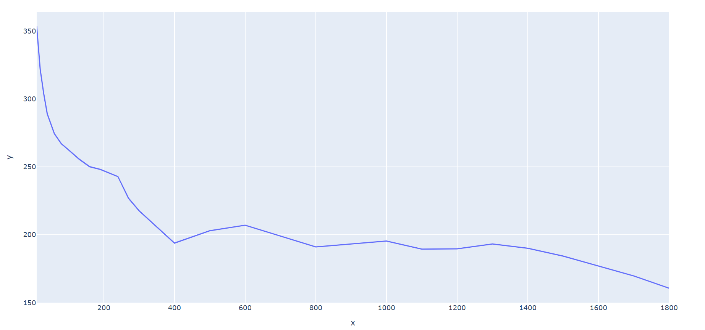

# Termin 4: Aufgabe PowerCurve

Die PowerCurve gibt an wieviel lange ein Radfahrer welche Wattanzahl durchhält.

Gestartet kann die App entweder in VS Coder über den Start-Button oder im Terminal mittels dem Befehl: python advanced_powercurve.py